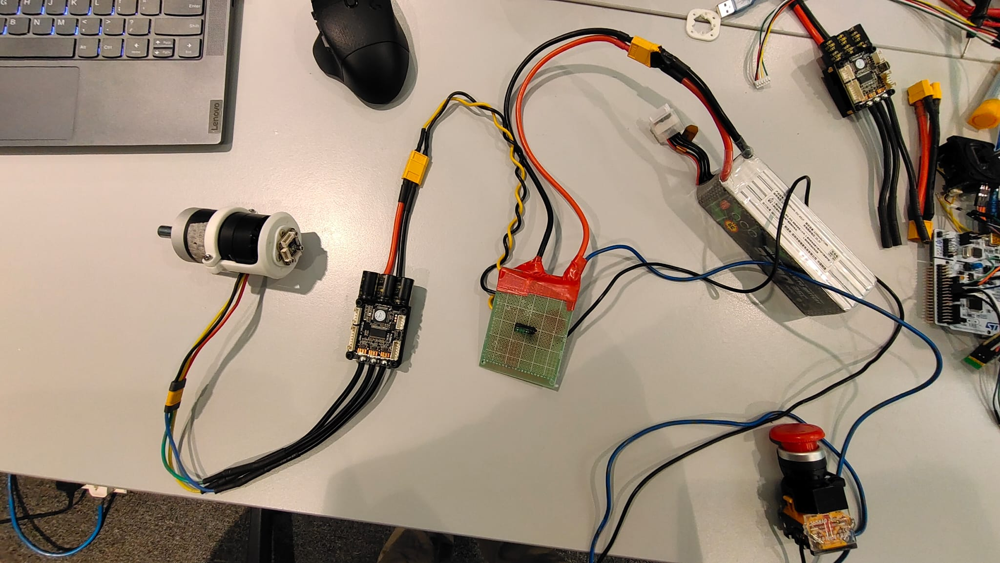
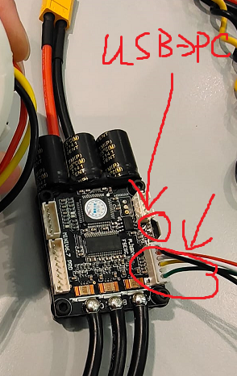
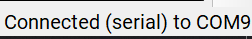
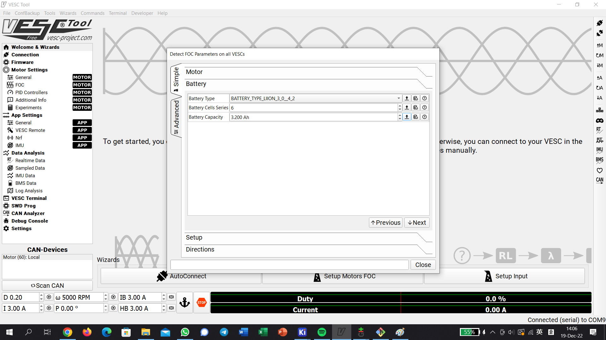
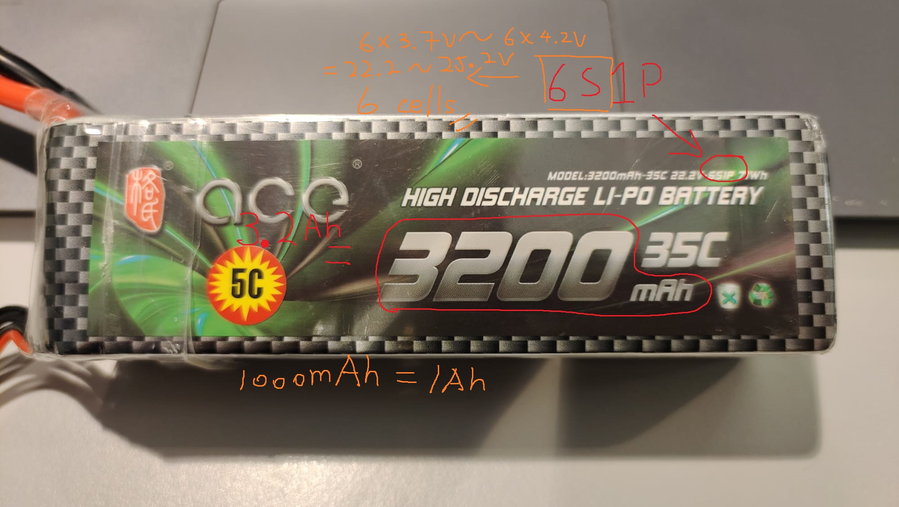
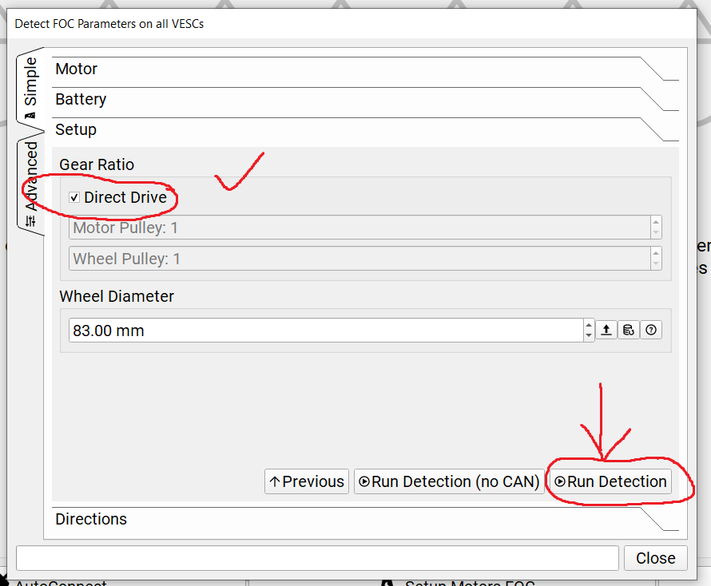
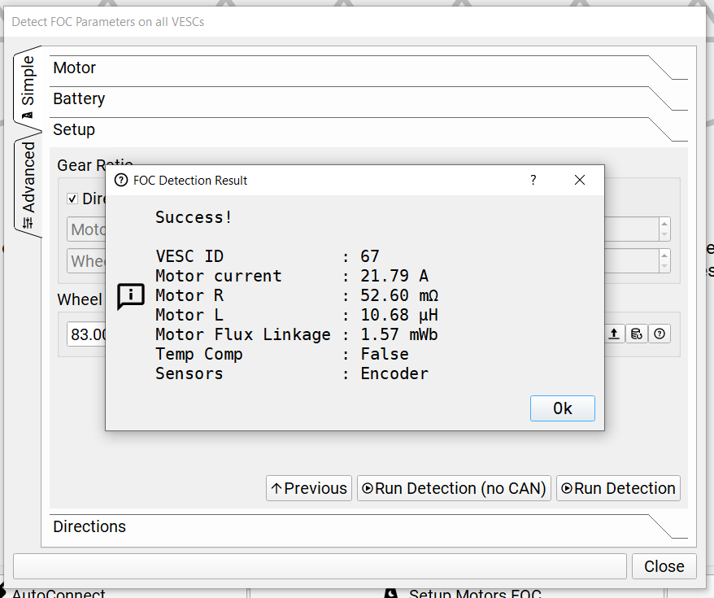

# VESC tutorial

# Index
1. [What is VESC?](#vesc)
2. How to control the motor by VESC?
    1. [Without coding: VESC Tool](#vesctool)
        1. [Connection](#vesctool_conn)
        2. [Calibration](#vesctool_calib)
        3. [Controlling](#vesctool_control)
    2. [With coding: MUCs](#withcoding)

## What is VESC? 
VESC is an open source project. Some BLDC motor drivers developed from the project. Visit the [VESC Project Website](https://vesc-project.com/Hardware), get more information.

## How to control the motor by VESC?
### Without coding: VESC Tool 
We can use VESC Tool to control the motor without coding. First, you need to download VESC Tool from [VESC Project Website](https://vesc-project.com/vesc_tool) (You need to create an account). Or you can find the app in private repositories, path: [Useful-resource](https://github.com/IVE-LWL-Robocon/Useful-resource) -> [vesc](https://github.com/IVE-LWL-Robocon/Useful-resource/tree/main/vesc). We recommend to use version 3.00, not the latest one (ver. 3.01). The latest version is not stable, use it as your risk. You try, you die, don't ask why.

#### Connection 
Below picture is an example. It shows how to connect the power part. 
  

Connect the encoder with vesc, if it has. (if doesn't, it is fine) Below picture show the connection. 
<>
  

Then, connect the vesc to PC and turn on the estop. Run the VESC Tool. In "Welcome & Wizards" page, click "AutoConnect". 
  
If auto connection failed, we need to manual connect, the operation is similar with Arduino IDE. Change to "Connection" page. Reflash the COM list and select correct COM. Set the baud rate is ***115200***. And connect. If it does not work, please check the connection cable and power source. 
*p.s. The vesc should light up the LEDs, if doesn't, it means that no power supply from battery. It would not working.* 
  

If you see the rigth corner show message like below, it connected. 

#### Calibration 
!!!!!!!!!!!!!!!!!!!!!!!!!!!!!!!!!!!!!!!!!!!!!!!!!!!!!!!!!!!!!!!!!!!!!!!!!!!!!!!!!!!!!!!!!!!!!!!!!!!!!!!!!!!!!!!!!!!!!!!!!!!!!!!!!!!!!!!!!!!!!!!!!!!!!!!!!!!!!!!!!!! 
***If you change the setup of motor or replace motor, you need to re-calibration again. It is very important. Otherwise it may lose control and burn the driver and motor.*** 
!!!!!!!!!!!!!!!!!!!!!!!!!!!!!!!!!!!!!!!!!!!!!!!!!!!!!!!!!!!!!!!!!!!!!!!!!!!!!!!!!!!!!!!!!!!!!!!!!!!!!!!!!!!!!!!!!!!!!!!!!!!!!!!!!!!!!!!!!!!!!!!!!!!!!!!!!!!!!!!!!!! 

Back to "Welcome & Wizards" page, click "Setup Motors FOC" to calibrate. 
  

It will show the pop up. Based on your devices, select the suitable choice. For example, DJI M3508 P19 is an outrunner motor and the weight is around 380g. Therefore, we select 200g outrunning motor. And click "Next". It will show a warning. If you confirm it is fine, just click yes. 
  

  
Select the type of battery, we always use Li-ion battery (鋰電池). 
Below figures are example, it show how to know the number of cells series. 
1. Check the label on the packet. "P" part means Parallel. The "S" part means "Series". "6S1P" means 6 cells in serises, 1 parallel. Therefore, we should type 6 in the box.  
*!!!!!!  Warning  !!!!!! 
Don't mxied up the "Series" and "Parallel", you should type **the number of "Series"**. 
Otherwise it may damage the vesc, motor and battery* 
!!!!!!!!!!!!!!!!!!!!!!!!!!!!!!!!!!!!!!!!!!!!!!!!!!!!!!!!!!!!!!!!!!!!!!!!!!!!!!!!!!!!!!!!!!!!!!!!!!!!!!!!!!!!!!!!!!!!!!!!!!!!!!!!!!!!!!!!!!!!!!!!!!!!!!!!!!!!!!!!!!!! 
 

2. Count number of the packet number.  
  

The battery packet labels its capacity. 1000mAH = 1AH, transform by yourself or online calculator. In the example, 3200mAh = 3.2Ah, therefore we should type 3.2. And click "Next". 

Check the "Direct Drive". then click "Run Detection".  
It will popup a message. Before you confirm it, please make sure that the motor is clear and hold your estop. After you confirmed, it will make some noise and start to rotate. It is normal. *If you don't think so, press the estop button immediately*. 
 

Wait a few mins, it will show you the message like below. It means the calibration finished. 
 

#### Controlling 
Coming soon~

## With coding: MUCs 
Coming soon~
